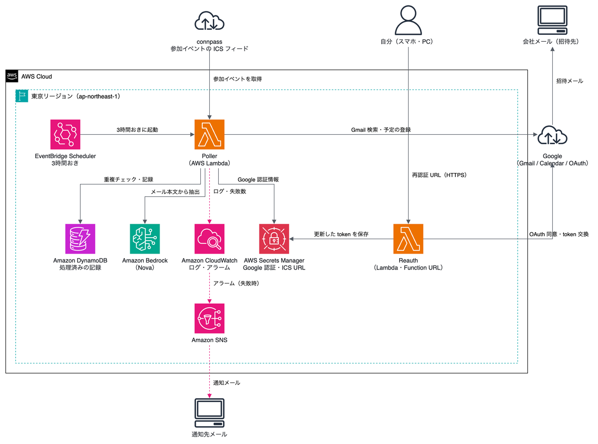

# Tech Event Calendar Auto-Registration Agent (tech-event-calendar-agent)

A serverless app that automatically detects "reservation confirmation" emails you receive after registering for tech events (meetups, conferences), extracts the event details with Amazon Bedrock, and registers them on your personal Google Calendar with full details. If you also want to share the event with other accounts (a company Outlook mailbox, a friend's address, or anything other than Google Calendar), add one or more addresses as attendees, and Google Calendar sends each of them a standard meeting-invite email. You can optionally mark the event `private`, so its details stay hidden from anyone who merely has viewing access to your calendar, while invited attendees still see the full details.

The reservation itself is not automated, since it requires a manual login to each site. This app only automates the calendar registration that happens after the confirmation email arrives.

See [CHANGELOG.md](CHANGELOG.md) for what changed between versions.

## Architecture



Editable source: [docs/architecture.drawio](docs/architecture.drawio) (the PNG embeds the diagram XML, so it can also be opened directly in draw.io).

## Components

- **Amazon EventBridge Scheduler** — triggers the Lambda every 3 hours
- **AWS Lambda** (Python 3.12, `src/app.py`) — connpass ICS feed sync + Gmail search → Bedrock extraction → DynamoDB dedupe check → calendar registration
- **Amazon Bedrock (Nova)** — extracts event name/date-time/location/URL from the email body as structured data (Converse API + tool-use); not used for connpass events registered via the ICS feed, since connpass itself already confirms those as genuine
- **Amazon DynamoDB** — records processed Gmail message IDs and connpass ICS event UIDs to prevent duplicate registration
- **AWS Secrets Manager** — stores the personal Google account's OAuth refresh token and (optionally) the connpass ICS feed URL

## Prerequisites

1. An AWS account, [AWS SAM CLI](https://docs.aws.amazon.com/serverless-application-model/latest/developerguide/install-sam-cli.html), and Docker (for `sam local invoke`)
2. [Enable access in the console](https://docs.aws.amazon.com/bedrock/latest/userguide/model-access.html) to the target Amazon Bedrock model (default: `amazon.nova-lite-v1:0`) in your deployment region
3. In Google Cloud Console, set up a project for your personal account, enable the Gmail API and Calendar API, and create an OAuth client (Desktop app) to download its JSON
   - **Set the OAuth consent screen to "In production"** (leaving it in "Testing" causes the refresh token to expire after 7 days, silently breaking the polling)
4. (Optional) If you also want to send invites to other addresses (e.g. a company Outlook mailbox), have them ready. Pass them as the comma-separated `AttendeeEmails` parameter at deploy time.
5. (Optional) For connpass events specifically, get your personal "joined events" iCalendar subscription URL from your connpass account settings (`webcal://connpass.com/joinmanage/<token>.ics`). This lets the app register connpass events straight from connpass's own record of what you joined, without relying on Gmail/Bedrock classification for that platform. See "Optional: connpass ICS feed" below.

## Deployment

```bash
sam build
sam deploy --guided
```

If you specify addresses in the comma-separated `AttendeeEmails` parameter, each one is added as an attendee to every registered event, and Google Calendar sends each of them a standard meeting-invite email (with the full title, location, and URL included as-is — attendees always see the same details you do). Leave it empty to skip sending invites.

Set `EventVisibility` to `private` if you want the event's details hidden from anyone who merely has viewing access to your calendar (e.g. coworkers with shared-calendar visibility), without affecting what invited attendees see. This is useful when, say, the attendee is your own company mailbox and you want colleagues who can see that mailbox's calendar to only see "busy," not the event's real title.

After deployment, the secret created in Secrets Manager (`tech-event-agent/google-personal`) still holds placeholder values. Run the following script once to write the real refresh token:

```bash
pip install -r scripts/requirements.txt

python scripts/generate_refresh_token.py \
  --client-secrets-file ~/Downloads/client_secret_personal.json \
  --secret-name tech-event-agent/google-personal
```

A browser window will open — log in and consent with the matching Google account.

> An invite email arriving in Outlook is not guaranteed to be added as a calendar event automatically. Depending on the company's Exchange/Outlook settings, the recipient may need to manually "accept" the invite.

### Optional: connpass ICS feed

connpass provides each user a personal iCalendar subscription feed of events they've actually joined (find it in your connpass account settings — it looks like `webcal://connpass.com/joinmanage/<token>.ics`). Since connpass itself curates this list, the app registers these events directly, with no Bedrock classification involved and no risk of the false positives that plague the Gmail-based approach (event-published notices, reminders, organizer broadcasts, etc. never appear in this feed).

To enable it, write the URL into the secret created by the deploy (a plain string, no OAuth flow needed):

```bash
aws secretsmanager put-secret-value \
  --secret-id tech-event-agent/connpass-ics \
  --secret-string "webcal://connpass.com/joinmanage/<your-token>.ics"
```

Leave the secret as its `REPLACE_ME` placeholder (the default after deploy) to skip this feature entirely — connpass events then keep flowing through the regular Gmail+Bedrock path as before.

#### Migrating connpass from Gmail+Bedrock to the ICS feed

`GmailSenderAllowlist` no longer includes `connpass.com` by default for **new** deployments — CloudFormation `Default` values only apply on stack creation, so if you're updating an existing stack, its `GmailSenderAllowlist` parameter value is untouched until you explicitly override it. The Gmail path and the ICS feed path use independent dedupe keys, so running both for connpass at the same time can register the same event twice. Migrate in this order:

1. Deploy the updated template (`GmailSenderAllowlist` still includes `connpass.com` on an existing stack — this step just creates the `ConnpassIcsSecret` resource).
2. Put your real ICS URL into `tech-event-agent/connpass-ics` (command above).
3. Confirm the ICS feed is working — check CloudWatch Logs or DynamoDB for new `connpass-ics:*` items.
4. Once confirmed, redeploy with `connpass.com` removed from `GmailSenderAllowlist`:
   ```bash
   sam deploy --parameter-overrides GmailSenderAllowlist="peatix.com,techplay.jp,doorkeeper.jp,eventbrite.com"
   ```

## Testing Locally Against Deployed Resources

To safely try the real Gmail search and Bedrock extraction against your deployed AWS resources (calendar writes are skipped): `DDB_TABLE_NAME` and `SECRET_NAME_PERSONAL_GOOGLE` are required (use the table name / secret name shown in `sam deploy`'s Outputs), and since `GMAIL_SENDER_ALLOWLIST`/`GMAIL_KEYWORDS` default to empty and error out if both are unset, specify at least one:

```bash
DRY_RUN=true \
DDB_TABLE_NAME=<table name from sam deploy Outputs> \
SECRET_NAME_PERSONAL_GOOGLE=tech-event-agent/google-personal \
GMAIL_SENDER_ALLOWLIST="peatix.com,techplay.jp,doorkeeper.jp,eventbrite.com" \
GMAIL_KEYWORDS="予約が完了しました,登録が完了しました,confirmation,registration confirmed" \
python src/app.py
```

Once you're satisfied, set `DRY_RUN=false` to confirm the calendar is actually being registered. To invoke the deployed Lambda directly:

```bash
aws lambda invoke --function-name <PollerFunction Output value> --region <deployment region> /tmp/out.json && cat /tmp/out.json
```

### Classification criteria for reservation-confirmation emails

Bedrock is instructed to strictly judge only whether an email explicitly confirms that the recipient personally just completed a reservation/registration (see `_system_prompt` in `src/bedrock_extractor.py`). The following are treated as `is_event_confirmation=false` even when they include event details such as date/time and location:

- New-event publication notices ("X published an event")
- Reminders about an upcoming event or a closing registration window ("is tomorrow", "registration closes tomorrow")
- Broadcast messages from event organizers or group admins ("message from the event organizer")
- Newsletters or recommended-events digests

The default values of `GMAIL_KEYWORDS` (e.g. "予約が完了しました") don't exactly match connpass's actual wording (e.g. "参加申し込みが完了しました", "参加が確定しました"). This causes no harm in practice since domains in `GMAIL_SENDER_ALLOWLIST` are matched regardless of content, but if you want to pick up confirmation emails from platforms outside the allowlist, adjust the keywords to match their actual wording.

## Environment Variables

These can be overridden as `template.yaml` parameters. The main ones:

| Variable | Default | Description |
|---|---|---|
| `GMAIL_SENDER_ALLOWLIST` | peatix.com, techplay.jp, doorkeeper.jp, eventbrite.com | Sender-domain allowlist (connpass excluded by default — see the ICS feed section) |
| `GMAIL_KEYWORDS` | 予約が完了しました, 登録が完了しました, confirmation, registration confirmed | Subject/body keywords |
| `GMAIL_SEARCH_WINDOW` | `newer_than:3d` | Gmail search time window |
| `CONFIDENCE_THRESHOLD` | `0.6` | Skip if Bedrock's confidence is below this value |
| `DEFAULT_DURATION_MINUTES` | `120` | Default duration used when the end time can't be extracted |
| `PERSONAL_CALENDAR_ID` | `primary` | Target calendar ID |
| `ATTENDEE_EMAILS` | (empty) | Comma-separated addresses invited as attendees via email |
| `EVENT_VISIBILITY` | `default` | `private` hides event details from other viewers of the calendar (not from invited attendees) |
| `DRY_RUN` | `false` | Set to `true` to skip calendar writes |

## Known Limitations (out of scope for v1)

- Updating/deleting the calendar event when a cancellation email is detected is not supported (planned for a future version)
- SES notifications are disabled by default (`SES_ENABLED` is not implemented; may be added if needed)
- `EVENT_VISIBILITY=private` only hides details from other viewers of the calendar; invited attendees (via `ATTENDEE_EMAILS`) always see the full event details, since Google Calendar has no way to vary what's shown per attendee
- Automatic acceptance of the invite on the Outlook side is not guaranteed (manual acceptance may be required)
- The connpass ICS feed and the Gmail+Bedrock path use independent dedupe keys; leaving both enabled for connpass at once can register the same event twice (see the migration steps above)
- The ICS feed only covers connpass — other platforms (Peatix, TECH PLAY, Doorkeeper, Eventbrite) still rely on Gmail+Bedrock classification
- If connpass reissues your ICS feed token, the secret needs to be updated with the new URL
